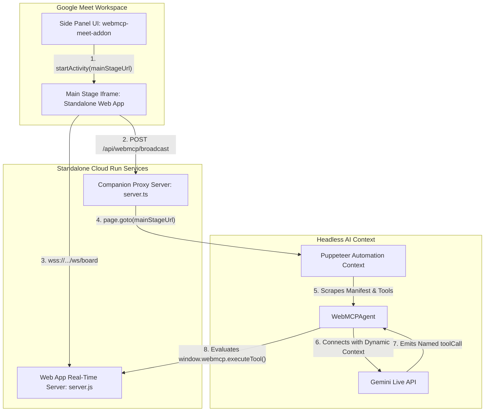

# WebMCP Proactive Shadowing Companion - Multimodal AI in Google Meet

This project demonstrates how to build a **fully UI-agnostic and application-agnostic proactive shadowing companion** as a **Google Meet Add-on** running on **Google Cloud Run**. 

The companion does not contain any pre-configured knowledge of the target application structure (like columns, slide decks, or sheet cells). Instead, it maps on-demand to *any* collaborative, WebMCP-compliant web application promoted to the Google Meet Main Stage at runtime.

> [!NOTE]
> The Kanban Board web application included in this repository is provided strictly as a concrete sample to demonstrate the shadowing capabilities. You can substitute it with *any* web application (e.g., spreadsheets, drawing canvases, CRMs, document editors) by integrating the WebMCP Client SDK.

It listens to meeting discussions in real-time, automatically and proactively identifies actionable task modifications or state transitions, and uses the dynamically discovered WebMCP manifest and tools of the active main stage page to execute actions silently.

> [!NOTE]
> The Meet Media API and the Gemini Live model `gemini-3.1-flash-live-preview` are all currently in preview. You need to request access to the [Google Workspace Developer Preview Program (DPP)](https://developers.google.com/workspace/preview).

---

## Decoupled Architecture

The workspace is engineered as a fully decoupled, two-tier architecture allowing any web application to adopt WebMCP and be instantly automatable:



### 1. Universal WebMCP Client SDK (`@webmcp/client`)
Applications define their domain identity, proactive shadowing instructions, and tool schemas using a universal client SDK. 

In modern modular applications (like our Kanban sample), tool registration is extracted into a dedicated adapter file (e.g., `webmcp-adapter.ts`):

```typescript
import webmcp from '@webmcp/client';

export function registerWebMCPTools({ board, addTask, editTask, deleteTask }) {
  webmcp.init({
    manifest: {
      appName: "WebMCP Kanban",
      systemInstruction: "You are a proactive AI shadowing companion. Monitor meeting audio and execute tasks silently."
    }
  });

  webmcp.registerTool({
    name: 'addTask',
    description: 'Add a task to a column',
    parameters: { columnId: { type: 'string' }, content: { type: 'string' } },
    passNamedArguments: true,
    execute: (args) => addTask(args.columnId, args.content)
  });
}
```

### 2. Generic Companion Proxy Server (`agent-client`)
* **Backend Agnosticism**: [server.ts](file:///usr/local/google/home/pierrick/git/webmcp-live-agent/agent-client/src/server.ts) acts strictly as a universal WebMCP event broadcaster and proxy server, containing zero domain-specific storage or persistence logic.
* **Dynamic Context Ingestion**: When a URL is promoted to the Main Stage, [agent.ts](file:///usr/local/google/home/pierrick/git/webmcp-live-agent/agent-client/src/agent.ts) automates a headless Puppeteer browser, waiting deterministically for `webmcp.getManifest()` to populate before establishing a bidirectional Gemini Live WebSocket session (`gemini-3.1-flash-live-preview`).
* **Named Parameter Execution**: Automatically routes Gemini function calls through `webmcp.executeTool()`, supporting both named options objects and positional mapping.
* **Streamlined Execution**: Purely relies on audio streaming and structured WebMCP tool invocation over WebSockets, eliminating visual screenshot overhead and unneeded telemetry handlers for maximum performance.

### 3. Standalone Web Application (`kanban-web-app`)
* **Autonomous Real-Time Server**: The Kanban sample runs its own independent Express + WebSocket server ([server.js](file:///usr/local/google/home/pierrick/git/webmcp-live-agent/kanban-web-app/server.js)), managing multi-user board synchronization (`/ws/board`) entirely in memory.
* **Modular Meet Handshake**: Employs the standalone `@webmcp/meet-addon-loader` package to execute the Google Meet iframe initialization handshake cleanly, maintaining zero direct Workspace SDK dependencies in its core application logic.

---

## Project Structure

This repository is organized as a monorepo with the following sub-projects:

- **[agent-client](./agent-client)**: The generic companion proxy server that automates the target application and connects to Gemini Live.
- **[kanban-web-app](./kanban-web-app)**: A sample collaborative Kanban board application that implements the WebMCP protocol.
- **[webmcp-client](./webmcp-client)**: The client SDK used by web applications to register tools and manifest.
- **[meet-addon-loader](./meet-addon-loader)**: A helper library for loading the Meet Add-on SDK in the iframe.

Each sub-project contains its own dedicated `README.md` with detailed information and overviews.

---

## Augmenting Any Existing Web Application

You can turn any existing web application into an AI-automated collaborative workspace in minutes by following these steps.

### Step 1: Install Dependencies

You need to add the WebMCP client SDK and the Meet Add-on loader to your application. If you are working within this monorepo, you can link to them directly:

```bash
# If using local file links in monorepo
npm install file:../webmcp-client file:../meet-addon-loader
```

### Step 2: Create the WebMCP Adapter

Generate a dedicated `webmcp-adapter.ts` (or `.js`) file that maps your application's state and methods to WebMCP tools.

#### Option A: Use an LLM to generate it
You can provide this prompt to any LLM such as Gemini to automatically generate the file:

```text
You are an expert AI and Web Development assistant. I want to enable my existing web application to be automated by an AI shadowing companion (e.g., Puppeteer + Gemini Live) using the WebMCP protocol.

Here is my application's client-side state store, context methods, or internal API functions:
[PASTE YOUR APP'S STATE/API METHODS HERE]

Please generate a dedicated, drop-in `webmcp-adapter.ts` (or `.js`) file that exports a single registration function (e.g., `registerWebMCPTools(context)`). The file must follow these exact requirements:

1. MANIFEST INITIALIZATION:
Inside `registerWebMCPTools`, call `window.webmcp.init(...)` (or `webmcp.init`) with a descriptive `appName` and a highly detailed `systemInstruction` instructing Gemini Live to act as a silent, proactive shadowing assistant for this specific application domain.
- Instruct the AI to use its best judgement and recent discussion history to infer missing or ambiguous parameters from the meeting audio.
- Instruct the AI to leverage `getBoardSummary` (or similar summary tools) to discover active entity IDs prior to executing mutations.

2. TOOL REGISTRATION:
For every available action method in my app context, call `window.webmcp.registerTool(...)`.
- Define parameters using standard JSON Schema format (`type: 'object', properties: { ... }`).
- If the underlying function expects an options object, set `passNamedArguments: true` so the adapter passes the arguments object directly.
- Include clear console logging inside each tool's `execute` callback so developers can observe AI actions in browser DevTools.

Ensure the output is modular and ready to be imported into my main application component.
```

#### Option B: Write it manually
Here is a concrete example of what a minimal WebMCP adapter looks like:

```typescript
import webmcp from '@webmcp/client';

export function registerWebMCPTools({ board, addTask }) {
  // 1. Initialize Manifest
  webmcp.init({
    manifest: {
      appName: "My App",
      systemInstruction: "You are a proactive AI shadowing companion. Monitor meeting audio and execute tasks silently."
    }
  });

  // 2. Register Tools
  webmcp.registerTool({
    name: 'addTask',
    description: 'Add a task',
    parameters: {
      content: { type: 'string', description: 'The text content of the task' }
    },
    execute: (content) => {
      console.log(`Executing addTask with: ${content}`);
      addTask(content);
    }
  });
}
```

### Step 3: Initialize in Application

Import the registration function and call it with your application's store or context methods. This is typically done in your main component or where the state is initialized.

```typescript
import { useEffect } from 'react';
import { registerWebMCPTools } from './webmcp-adapter';
import { useBoardStore } from './store'; // Example store

export function App() {
  const board = useBoardStore();
  
  useEffect(() => {
    registerWebMCPTools({
      board: board.data,
      addTask: board.addTask,
      // ... other methods
    });
  }, []);
  
  return (
    // ... your app UI
  );
}
```

### Step 4: Initialize the Meet Add-on Handshake

To be allowed to run on the Google Meet Main Stage, your application must execute the initialization handshake. Call this early in your application lifecycle (e.g., in `main.tsx` or `App.tsx`).

```typescript
import { initializeMeetAddon } from '@webmcp/meet-addon-loader';

initializeMeetAddon().then((sdk) => {
  console.log("Meet Add-on SDK initialized successfully");
}).catch((err) => {
  console.error("Failed to initialize Meet Add-on SDK:", err);
});
```

---

## Main Features

- **Dynamic App-Agnostic Shadowing**: Dynamically shadow *any* collaborative WebMCP-compliant application promoted to the Main Stage at runtime by discovering and schema-parsing its manifest and tools on-the-fly.
- **Conversational History Inference**: AI companions actively reason over recent discussion history and use best judgement to resolve ambiguous or incomplete vocal requests.
- **Low-Latency Gemini Live**: Gemini Live listens directly to raw WebRTC audio streams over high-performance bidirectional WebSocket streams, reasons, and proactively calls tools silently over the same connection.
- **Universal Event Bridge**: Provides an optional sync bridge (`/api/webmcp/broadcast`) for lightweight client-side apps without their own real-time backend.
- **Speaker-Track Voice Association**: Resolves WebRTC participant audio tracks to `signedInUser.displayName` in real-time using Workspace Media API track metadata.
- **Zero-Config Deployment**: Eliminates hardcoded URL environment variables, allowing you to deploy both the Kanban Board and the Add-on backend proxy independently.

---

## Prerequisites

Ensure you have:
1. **Google Cloud Project**: A project with billing enabled that has been granted access to the Meet Media API Developer Preview Program (DPP).
2. **gcloud CLI**: Installed and authenticated.
3. **Gemini API Key**: Get one from [Google AI Studio](https://aistudio.google.com/).
4. **Google Workspace Account**: With permissions to create and use Meet Add-ons.
5. **Node.js**: Version >22.

---

## Setup & Deployment Instructions

Follow these steps to configure the cloud resources and deploy the companion to Cloud Run:

### 1. Enable Cloud Services
```bash
gcloud services enable meet.googleapis.com \
                       artifactregistry.googleapis.com \
                       run.googleapis.com \
                       cloudbuild.googleapis.com \
                       appsmarket.googleapis.com \
                       appsmarket-component.googleapis.com \
                       gsuiteaddons.googleapis.com
```

### 2. Configure OAuth Consent Screen
1. Go to the **APIs & Services > OAuth consent screen** page in the Google Cloud Console.
2. Select **App name** as `WebMCP Proactive Shadowing Companion` and **User support email** to your support email, then click **Next**.
3. Select **Internal** for the User Type (this is sufficient for testing within your Workspace organization).
4. Under **Data Access**, click **Add or remove scopes**. Paste:
   `https://www.googleapis.com/auth/meetings.space.created https://www.googleapis.com/auth/meetings.conference.media.readonly https://www.googleapis.com/auth/meetings.space.readonly`
5. Review and save.

### 3. Create OAuth Web Client Credentials
1. Navigate to the **APIs & Services > Credentials** page in the Cloud Console.
2. Click **+ Create Credentials** -> **OAuth client ID**.
3. Select **Web application** as the application type. Set **Name** to `WebMCP Shadowing Companion Client`.
4. Click **Create** and copy the **Client ID**.

### 4. Configure Environment Variables

Copy the sample environment file at the project root to `.env`:

```bash
cp sample.env .env
```

Edit the `.env` file and provide values for:

* `PROJECT_ID`: Your Google Cloud Project ID.
* `REGION`: The region to deploy to (e.g., `us-central1`).
* `GEMINI_API_KEY`: Your Gemini API key from AI Studio.
* `CLOUD_PROJECT_NUMBER`: Your Google Cloud Project Number (found in Project Settings).
* `CLIENT_ID`: Your OAuth 2.0 Client ID (see step 3).
* `DEFAULT_BOARD_URL`: Your standalone Kanban Cloud Run URL.

You can use the following commands to retrieve some of the required values:

```bash
# Get Project ID
gcloud config get-value project

# Get Project Number
gcloud projects describe $(gcloud config get-value project) --format="value(projectNumber)"
```


### 5. Deploy to Cloud Run
The workspace is split into independent services allowing you to deploy the collaborative Kanban board sample and the Meet Add-on companion proxy server separately:

#### Stage 5.1 Deploy the Kanban Web App Sample
This stage deploys the standalone real-time Kanban board container.
1. Make the deploy-board script executable and run it:
   ```bash
   chmod +x deploy-board.sh
   ./deploy-board.sh
   ```
2. Make a note of the resulting public URL, which is your **Kanban Board URL** (e.g., `https://webmcp-kanban-board-bbpy7qc6va-uc.a.run.app`). Set this value as `DEFAULT_BOARD_URL` in your `.env`.

#### Stage 5.2 Deploy the Meet Add-on Proxy Service
This stage deploys the generic shadowing companion server.
1. Make the deploy-companion script executable and run it:
   ```bash
   chmod +x deploy-companion.sh
   ./deploy-companion.sh
   ```
2. Copy the resulting public URL, which is your **Addon URL** (e.g., `https://webmcp-meet-addon-bbpy7qc6va-uc.a.run.app`). Use this to update your OAuth JavaScript origins and `deployment.json`.

### 6. Update OAuth Redirect URIs
1. Go back to **APIs & Services > Credentials** in the Cloud Console.
2. Edit your **WebMCP Shadowing Companion Client** OAuth 2.0 client ID.
3. Under **Authorized JavaScript origins**, add your Addon URL (e.g. `https://webmcp-meet-addon-xxx.run.app`).
4. Save.

### 7. Configure Google Workspace Add-on and Marketplace SDK

To make the app appear in Google Meet, you need to configure both the Workspace Add-on deployment and the Marketplace SDK.

#### 7.1 Configure Google Workspace Add-on (HTTP Deployment)

1. Open the `deployment.json` file in the root of the project.
2. Update the `addOnOrigins` and `sidePanelUrl` fields, replacing the placeholder `https://YOUR_ADDON_CLOUD_RUN_URL` with your actual Addon URL (obtained in Step 5.2).
3. Update the `addOnOrigins` field, replacing the placeholder `https://YOUR_WEBAPP_CLOUD_RUN_URL` with your actual web app URL (obtained in Stage 5.1).
4. Run the following command to create the deployment using the `gcloud` CLI:
   ```bash
   gcloud workspace-add-ons deployments create webmcp-shadow-companion \
       --deployment-file=deployment.json
   ```
5. The **Deployment ID** will be `webmcp-shadow-companion`. You will need this in the next step.

#### 7.2 Configure Google Workspace Marketplace SDK

1. Search and select **Google Workspace Marketplace SDK** in the Google Cloud Console.
2. Click **Manage** then select the **App Configuration** tab.
3. Set **App Visibility** to **Private** for testing.
4. Set **Installation Settings** to **Individual + Admin Install**.
5. Under **App Integrations** select **Google Workspace add-on**, select **HTTP or other deployments**, and select the deployment ID **webmcp-shadow-companion**.
6. Under **Developer Information**, set the **Developer Name**, **Developer Website URL**, and **Developer Email** to your own information.
7. Click **Save Draft**.

#### 7.3 Install the Add-on Deployment

To install the add-on for your account so you can see it in Google Meet, run the following command:
```bash
gcloud workspace-add-ons deployments install webmcp-shadow-companion
```

---

## Testing Your Add-on in Google Meet

1. Go to [Google Meet](https://meet.google.com) and start a new instant meeting.
2. Click **Meeting tools** (bottom right) -> **Add-ons** tab.
3. You should see **WebMCP Proactive Shadowing Companion** listed. Click on it to open the side panel.
4. Click **Connect to Meet Media API** to start. Complete the OAuth consent flow.
5. The sidebar shows a volume analyzer indicating that participant WebRTC tracks are streaming.
6. Verify your Kanban board public Cloud Run URL in the text field, and click **Shadow Board on Main Stage**.
7. The board will load in the **Main Stage Activity** in the center of the screen!
8. Gemini Live automatically establishes a bidirectional session and dynamically scrapes the WebMCP app manifest and tool schemas.
9. As you speak, **Gemini Live listens directly to the meeting audio, reasons, and proactively calls tools silently**, synchronizing cards on the Kanban board Main Stage Activity in real-time!

---

## Building Locally

To build the project locally to verify compiled assets before triggering deployment:

1. Navigate to the client folder:
   ```bash
   cd agent-client
   ```
2. Install the dependencies:
   ```bash
   npm install
   ```
3. Run the frontend/backend build command:
   ```bash
   npm run build
   ```
This generates the bundled assets in `dist/`.
